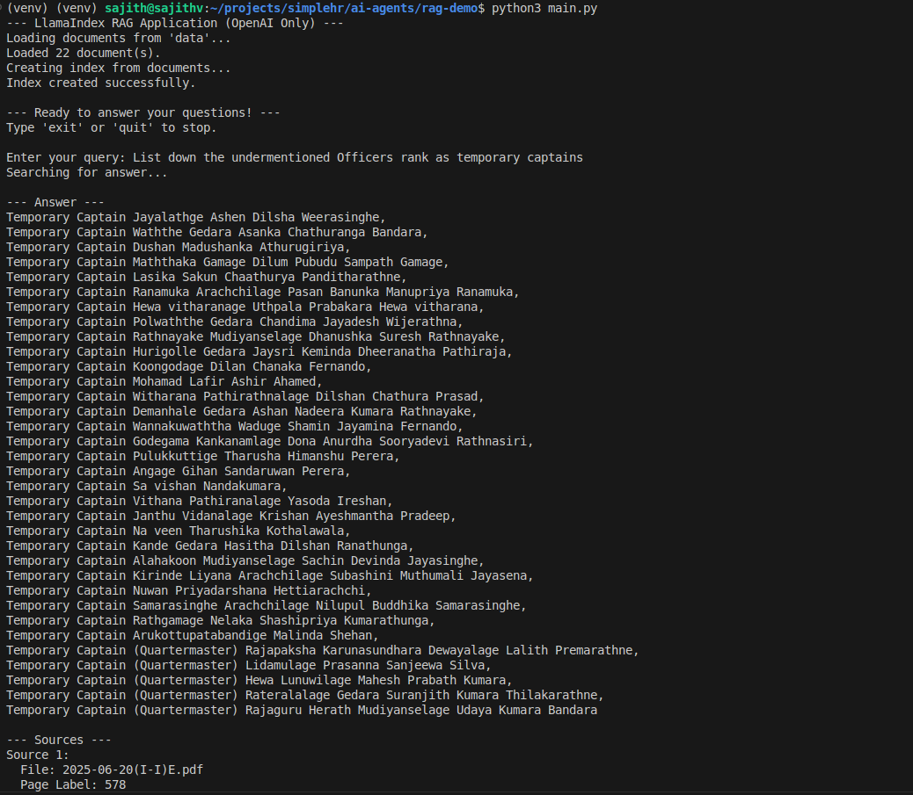

## Setup Instructions

Follow these steps to get the project up and running on your local machine.

### 1. Clone the Repository (if applicable)

If this project is hosted on a version control system (like Git), clone it to your local machine:

    git clone git@github.com:sajith4u/GazetteQuery.git

### 2. Create a Virtual Environment

It's highly recommended to use a virtual environment to manage project dependencies and avoid conflicts with other Python projects.

    
    python3 -m venv venv

    

### 3. Activate the Virtual Environment

Before installing dependencies or running the application, activate your virtual environment:

* **On macOS/Linux:**

    ```
    source venv/bin/activate
    
    ```

* **On Windows:**

    ```
    .\venv\Scripts\activate
    
    ```

You should see `(venv)` at the beginning of your terminal prompt, indicating the environment is active.

### 4. Install Dependencies

With your virtual environment activated, install all necessary packages using the `requirements.txt` file:

    
    pip3 install -r requirements.txt

    

## How to Run the Project

Once the setup is complete, you can run the application from your terminal:

1.  **Ensure your virtual environment is active.** (See Step 3 in Setup Instructions)

2.  **Run the main application script:**

    ```
    python3 main.py
    
    ```

The application will:

* Load and index the documents from your `data` directory.

* Prompt you to enter a query.

* Provide answers based on the content of your gazette files, along with the source documents.

* Type `exit` or `quit` to stop the application.

## Screenshots

### Example: Project Structure


### Example: Running the Application




